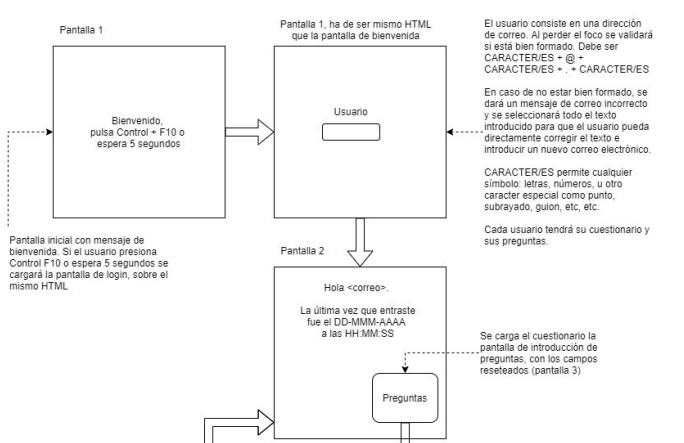
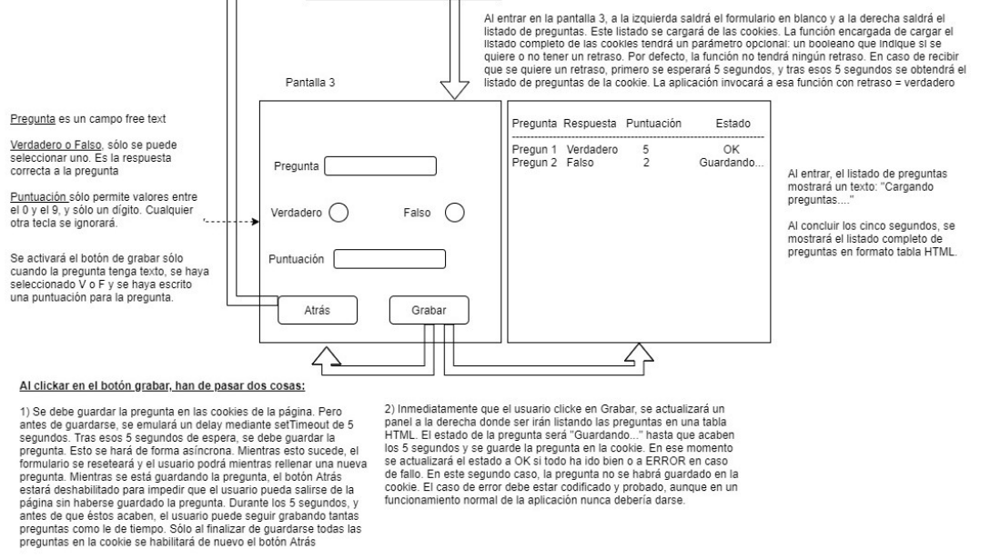
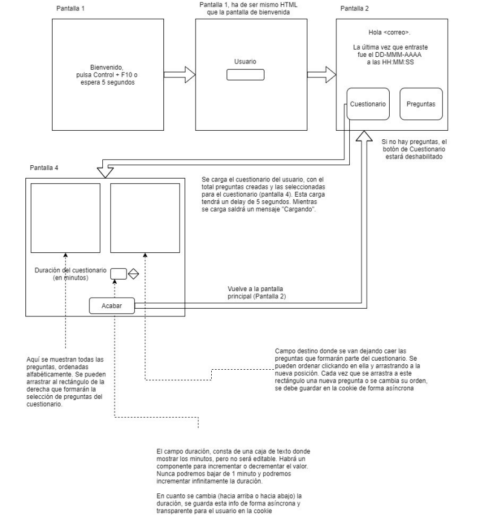
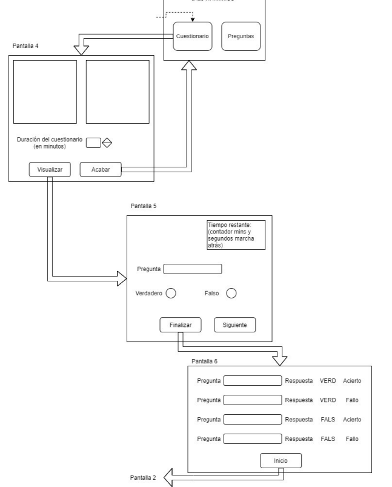

# 2DAW-ENT-CLI-proj-js-vanilla
Entrega proyecto JS vanilla para módulo Desarrollo Web en Entorno Cliente de 2ºDAW IES Serpis

## Descripción General

El proyecto se entrega indicando en la tarea la URL donde encontrar el desarrollo en GitHub. Es necesario que sea un repositorio nuevo. No reutilice el repositorio donde suele entregar las prácticas.

**El proyecto debe funcionar obligatoriamente en el navegador Firefox.**

Hay 2 versiones del proyecto:
- **Versión obligatoria** para todos.
- **Versión con extras** de funcionalidad. Es opcional. No puntúa. El objetivo es simplemente practicar más y aprender.

## Criterios de Evaluación

### 70% - Funcionamiento Correcto
- Debe cumplir con todos los requisitos indicados en esta práctica (error grave)
- No debe tener errores durante la ejecución (error leve)

### 30% - Calidad del Código
- Código bien estructurado y claro (error grave)
- Código no copiado de otras webs o IAs (error grave)
- No haya código duplicado (error grave)
- Captura de eventos según recomendaciones actuales (error grave)
- Bucles adecuados para cada situación (error leve)
- Uso de estructuras de datos adecuadas (error leve)
- Nomenclatura según best practices de Javascript (error leve)
- Comentarios correctos (error leve)
- Separación de HTML y Javascript (error leve)
- Código formateado con Prettier (error leve)
- Uso adecuado de funciones (error leve)

> **Nota:** El diseño con CSS no intervendrá en la nota.

---

## Parte Obligatoria

Aplicación para **crear preguntas con sus respuestas (verdadero y falso)** y la puntuación de cada una.

### Flujo de Navegación




<!-- #### Pantalla 1 - Bienvenida

"Bienvenido, pulsa Control + F10 o espera 5 segundos"

Tras pulsar o esperar:
Campo: Usuario (dirección de correo)

#### Pantalla 2 - Principal

"Hola «correo»."

"La última vez que entraste fue el DD-MMM-AAAA a las HH-MM-SS"

Botones: Preguntas, Cuestionario

#### Pantalla 3 - Gestión de Preguntas

Formulario para crear preguntas

Listado de preguntas existentes

### Validación de Usuario

- **Campo:** Dirección de correo electrónico
- **Validación:** Al perder el foco
- **Formato requerido:** `CARACTER/ES + @ + CARACTER/ES + . + CARACTER/ES`
- **CARACTER/ES permite:** letras, números, puntos, subrayados, guiones, etc.
- **Error:** Mensaje "correo incorrecto" + selección total del texto
- **Almacenamiento:** Cada usuario tiene su propio cuestionario y preguntas

### Formulario de Preguntas

| Campo | Tipo | Restricciones |
|-------|------|---------------|
| **Pregunta** | Texto libre | Obligatorio |
| **Verdadero/Falso** | Radio buttons | Solo uno seleccionable |
| **Puntuación** | Número | 0-9, un solo dígito |

**Activación del botón Grabar:**
- ✅ Pregunta tiene texto
- ✅ Verdadero o Falso seleccionado
- ✅ Puntuación escrita

### Gestión de Cookies y Almacenamiento

#### Carga de Preguntas
```javascript
function cargarPreguntas(retraso = true) {
    if (retraso) {
        // Esperar 5 segundos
        // Cargar de cookies
    } else {
        // Carga inmediata
    }
}
```

Al hacer clic en Grabar:

Guardado asíncrono en cookies:

Desgranante perfilmentor de 5 segundos antes de guardar

Formulario se resetea inmediatamente

Usuario puede rellenar nueva pregunta mientras se guarda

Botón Atrás deshabilitado durante el guardado

Usuario puede grabar múltiples preguntas simultáneamente

Actualización de la tabla:

Inmediatamente se actualiza la tabla HTML a la derecha

Estado de pregunta:

| Pregunta | Respuesta | Puntuación | Estado |
|---|---|---|---|
| Pregunta 1 | Verdadero | 5 | OK
| Pregunta 2 | Falso | 3 | Guardando...


 "Guardando..." → "OK" (éxito) o "ERROR" (fallo)

En caso de ERROR, la pregunta no se guarda en la cookie

El caso de error debe estar codificado y probado

Comportamiento inicial:

Al entrar: "Cargando preguntas...."

Tras 5 segundos: muestra listado completo en tabla HTML
º
-->

## Parte Opcional 1 - Creación de Cuestionarios
Se trata de utilizar las preguntas anteriores para crear un cuestionario seleccionando las
que queramos incluir y cuanto tiempo debe durar.
### Flujo

<!--
Pantalla 1 - Bienvenida (mismo HTML que pantalla de bienvenida obligatoria)

Pantalla 2 - Principal

"Hola <correo>."

"La última vez que entraste fue el DD-MMM-AAAA a las HH-MM-SS"

Botones: Cuestionario, Preguntas

Si no hay preguntas, el botón Cuestionario estará deshabilitado

Pantalla 4 - Configuración de Cuestionario

Duración del cuestionario (en minutos)

Botón: Acabar

Funcionalidades
Carga de cuestionario:

Se carga con delay de 5 segundos

Mientras carga: mensaje "Cargando"

Muestra total de preguntas creadas y seleccionadas para el cuestionario

Selección de preguntas:

Todas las preguntas ordenadas alfabéticamente

Se pueden arrastrar al rectángulo de la derecha (selección para cuestionario)

Campo destino donde se soltan las preguntas seleccionadas

Se pueden reordenar arrastrando a nueva posición

Cada cambio (añadir/ordenar) guarda en cookie de forma asíncrona

Duración del cuestionario:

Caja de texto no editable que muestra minutos

Componente para incrementar/decrementar valor

Mínimo: 1 minuto, máximo: infinito

Cada cambio guarda automáticamente en cookie de forma asíncrona
-->

## Parte Opcional 2 - Realización del Cuestionario
Se trata de poner en práctica el cuestionario anterior contestando a las preguntas y
finalmente mostrando el resultado de cada una de ellas.
### Flujo

<!--
Pantalla 2 - Principal

"Hola <correo>."

"La última vez que entraste fue el DD-MMM-AAAA a las HH:MM:SS"

Botones: Cuestionario, Preguntas

Información: Duración del cuestionario (en minutos)

Botones: Visualizar, Acabar

Pantalla 5 - Realización del Cuestionario

Tiempo restante: contador con minutos y segundos en marcha atrás

Botones: Verdadero, Falso

Botones: Finalizar, Siguiente

Pantalla 6 - Resultados

Tabla con resultados:

Pregunta

Respuesta (VERD/FALS)

Resultado (Acierto/Fallo)

Botón: Inicio (vuelve a Pantalla 2)
-->
